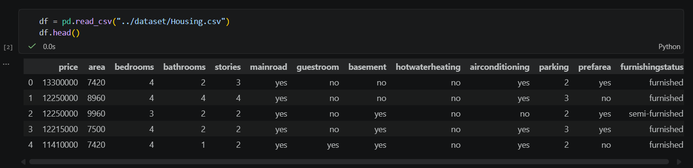
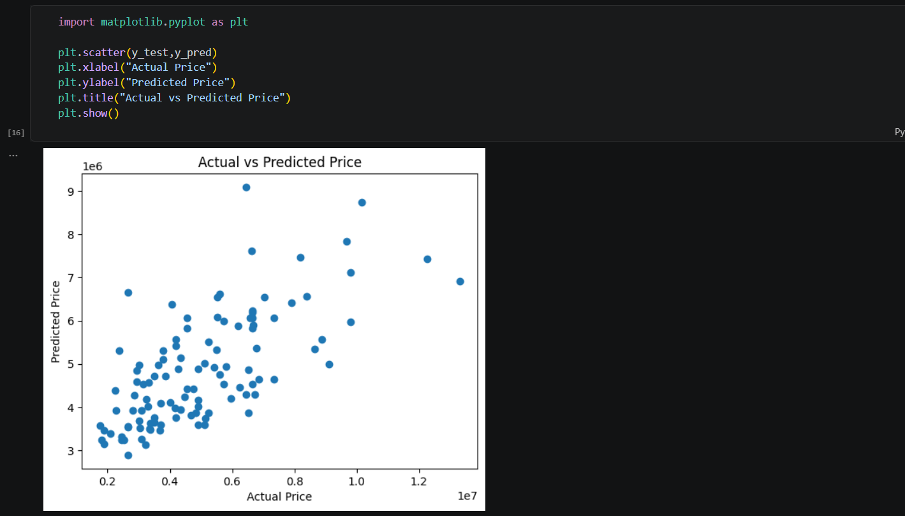
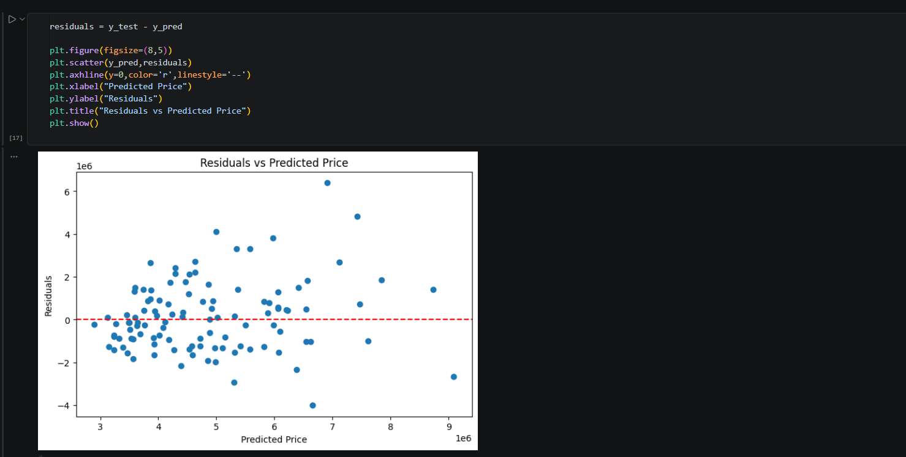

# House Price Prediction using Linear Regression

## Project Overview

This project predicts house prices using:
- Area
- Bedrooms
- Bathrooms

## Technologies Used

- Python
- Pandas
- NumPy
- Matplotlib
- Scikit-Learn

## Machine Learning Workflow

1. Data Loading
2. EDA
3. Feature Selection
4. Train-Test Split
5. Model Training
6. Prediction
7. Evaluation
8. Visualization

## Dataset Preview

## Actual vs Predicted House Prices

## Residual Plot

## Results

- Mean Absolute Error (MAE): 1265275.67
- Mean Squared Error (MSE): 2750040479309.05
- R² Score: 0.456

## Conclusion

The model successfully predicts house prices using selected features. This project helped me understand the complete Machine Learning workflow from data analysis to prediction and evaluation.